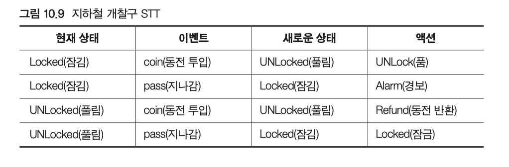

# 상태 다이어그램

UML 에서 유한 상태 기계(Finite State Machine, FSM)를 설명하기 위한 표기법이 풍부.

이 장에서는 FSM은 어떤 소프트웨어를 작성하든 굉장히 유용한 도구.

**기본 개념**

 위 그림은 사용자가 시스템에 로그인하는 방법을 제어하는 상태 기계를 기술하는 '간단한 상태 전이 다이어그램(state transition diagram, STD)' 

**모서리가 둥근 사각형은 '상태(state)'를 나타내고, 사각형을 둘로 나눠 위 부분을 각 상태의 이름을 적고, 아래 부분에는 그 상태에 들어가거나 나갈 때 특별히 무엇을 해야 할지 적는다.**

예를 들어, 로그인 메시지를 띄우기(Prompting for login) 상태에 들어갈 때에는 showLoginScreen 행동 호출. 나갈 때에는 hideLoginScreen 행동 호출

 상태 사이의 화살표는 '전이(transition)' 전이마다 그것을 발생시키는 이벤트의 이름이 붙어 있다. 몇몇 전이가 일어날 때 수행할 행동이 붙기도 하다. 몇몇 전이에는 전이가 일어날 때 수행할 행동이 붙기도 한 다. 예를 들어, Prompting for Login 상태에서 로그인 이벤트를 받으면, 사용자 검증하 기(Validating User) 상태로 전이하면서 validateUser 행동도 호출한다.

- 유한 상태 기계는 로그인 과정이 어떻게 작동하는지 명확히 정의하고, 또 이 과정을 작고 간결해서 좋은 함수들로 쪼개 주기까지 한다. 만약 showLoginScreen, validateUser, sendPassword 등의 행동 함수를 모두 구현한 다음, 이 다이어그램에서 보이는 논리 구조로 연결만 하면, 이 로그인 과정이 올바로 작동할 것임을 확신할 수 있다.

**특수 이벤트**

-  상태 사각형의 아래 부분에는 여러 ‘이벤트 / 행동’ 쌍이 들어 있다. 이것 가운데 들어옴(entry) 이벤트와 나감(exit) 이벤트는 표준 이벤트
- 자신만의 이벤트를 추가할 수도 있다. 만약 FSM이 어떤 상태에 있을 때 이런 특수 이벤트가 호출된다면, 그 이벤트에 대응하는 행동이 호출된다.

**상위 상태**

로그인 FSM 처럼 똑같은 이벤트에 똑같이 반응하는 상태들이 많다면 상위 상태를 사용하는 것이 편리하다. 이런 비슷한 상태를 둘러싼 상위 상태를 그린 다음, 상태마다 전이 화살표를 그리는 대신 상위 상태에만 그리면 된다. 

10.6 의 그림을 이해해보자.

 상위 상태도 보통상태처럼 들어옴 이벤트, 나감 이벤트, 특수 이벤트를 가질 수 있다. 

**그림 10.6은 상위 상태와 하위 상태 모두 들어옴 행동과 나감 행동이 있는 FSM이다.** 어떤 상태(Some State)에서 Sub 상태로 전이되어 들어오면 먼저 enterSuper 행동을 호출하고 그 다음 enterSub 행동을 호출한다. 

 마찬가지로, FSM 전이가 Sub2에서 어떤 상태(Some State)로 돌아간다면, 먼저 exitSub2를 호출한 다 음 exitSuper를 호출한다. 하지만, Sub에서 Sub2로 가는 e2 전이는 상위 상태 바깥 으로 나가지 않기 때문에, 단지 exitSub와 enterSub2만 호출한다.

#### 최초 의사-상태와 최종 의사-상태

 UML에서 자주 사용되는 두 의사-상태를 볼 수 있는데 FSM의 생명은 최초 의사-상태에서 전이되어 나오는 '과정'에서 시작. **최초 전이는 이벤트를 가지지 못하는데, 상태 기계 생성이 바로 이 전이를 시작하는 이벤트이기 때문.** 하지만 행동은 가질 수 있으며, 이 행동이 바로 FSM이 만들어진 다음 곧바로 호출하는 첫 행동

**FSM 다이어그램을 사용하기**

 이미 행동이 잘 알려진 하위 시스템의 상태 기계를 파악하는 일이라면 상태 다이어그램이 굉장히 도움이 된다.

 자주 진화하는 시스템에서는 그림으로 표현하는 FSM 보다는 글로 표련할 수 있는 상태 전이 테이블(state transtion table, STT) 좋다.

다음과 같은 지하철 개찰구 STD가 있다.

이것을 STT 로 바꾸면 이렇게 변한다.

 테이블의 행 하나는 전이 하나를 나타낸다. 테이블의 한 행을 보면, 전이 화살표의 시작 지점과 끝 지점, 그리고 이벤트 와 액션이 모두 들어 있다. STT를 읽을 때는 다음 문장을 기본 틀로 삼아서 읽으면 된다. “만약 Locked(잠김) 상태에서 coin(동전 투입) 이벤트를 받으면, Unlocked(풀림) 상태로 가고, Unlock(풀음) 함수를 호출한다.”

- 위 텍스트 파일을 읽어 들여서 그 논리를 구현하는 코드를 생성하는 간단한 컴파일러를 만들 수 있는데, SMC(State Machine Compiler) 이다.

**결론**

 유한 상태 기계(Finite State Machine)는 소프트웨어를 구조화할 때 쓸 수 있는 강력한 개념. UML은 FSM을 시각적으로 표현하는 매우 강력한 표기법을 제공한다. 하지만 FSM을 개발하거나 유지 보수할 때라면 다이어그램보다 텍스트 기반의 언어를 사용하는 것이 쉬운 경우가 많다.