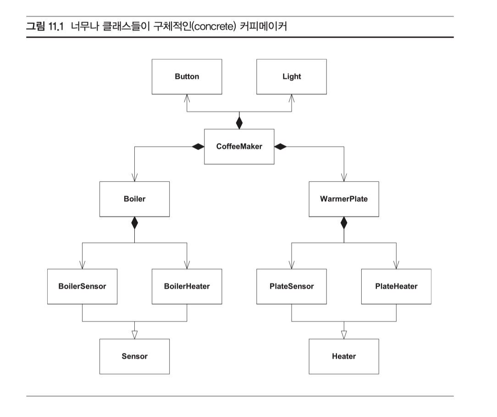
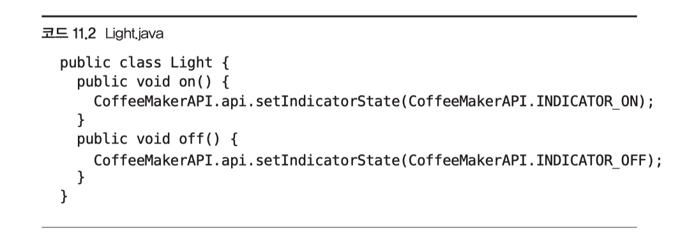
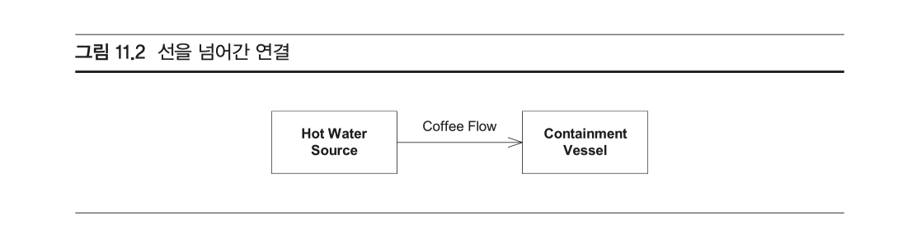
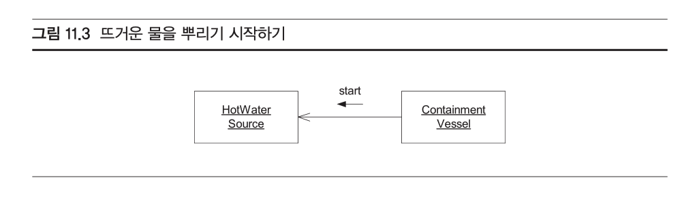
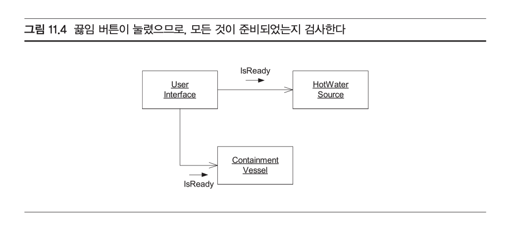
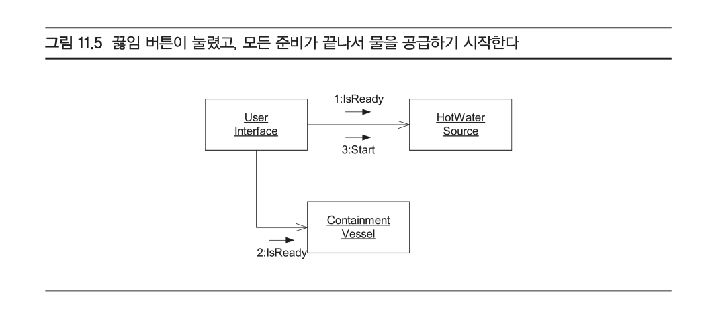
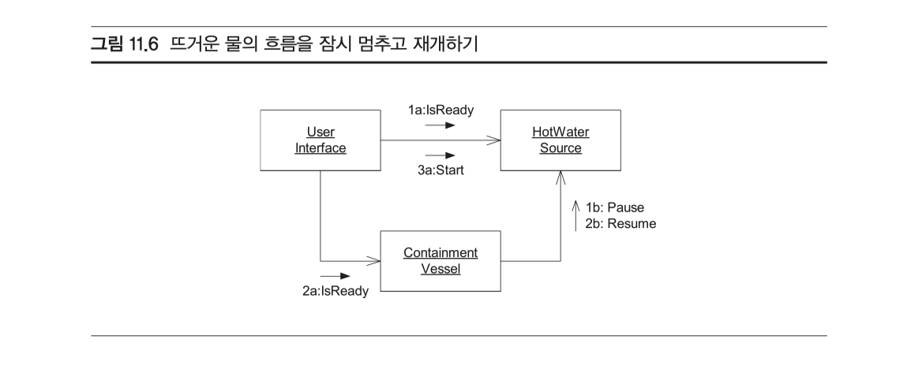

예제로 살펴보기

**마크 IV 특수 커피메이커**

요구사항

- 한 번에 커피를 최대 12잔까지 만들 수 있다.
- 사용자는 필터 받침에 필터를 올려놓고, 필터에 커피 가루를 채운 다음, 필터 받침을 기계의 제자리에 밀어 넣는다.
- 사용자는 최대 열두 잔 분량의 물을 여과기에 붓고 '끓임(Brew)'버튼을 눌러 끓을 때까지 계속 물을 데운다.
- 증기압이 점점 세지면서 물이 커피 가루 위에 뿌려지고, 만들어진 커피 방울이 필터를 거쳐 주전자로 떨어진다.
- 주전자는 온열판 위에 놓여 있어서 일정한 시간 동안 따뜻하게 유지되는데, 이 온열판은 주전자에 커피가 있을 때만 작동한다.
- 만약 커피 가루 위에 물을 뿌리는 동안 온열판에서 주전자를 치우면, 끓은 커피를 온열판 위에 흘리지 않도록 물 흐름을 멈추어야 한다.

다음 기계 장치들은 감시하거나 제어해야 한다

- 끓이는 장치를 위한 가열기, 켜거나 끌 수 있다.
- 온열판을 위한 가열기, 켜거나 끌 수 있다.
- 온열판을 위한 감시기
  - 세 가지 상태
    - warmerEmpty(온열판이 비어 있음)
    - potEmpty(주전자가 비어 있음)
    - potNotEmpty(주전자가 차 있음)
- 끓이는 장치를 위한 감지기.
  - 물이 있는지 없는지 측정한다.
    - boilerEmpty(장치가 비어있음)
    - boilerNotEmpty(장치가 비어 있지 않음)

- '끓임' 버튼. 순간 방식 버튼이며 커피를 만드는 전체 주기를 시작한다. 커피를 만드는 주기가 끝나고 커피가 준비될 때 불이 켜지는 작은 알림 장치가 들어 있다.
- 끓이는 장치의 압력을 줄이려고 열리는 압력 완화 밸프, 압력이 약해지면 필터에 뿌려지는 물 흐름이 멈춘다. 이 밸브는 열리거나 닫힐 수 있다.

많은 사람들이 실수하는 것..

CoffeeMaker 클래스의 등장인물은

 Boiler(끓이는 장치), 

WarmerPlate(온열판), 

Button(버튼), 

Light(불빛)가 있다. 

Boiler에는 BoilerSensor(끓이는 장치의 감지기)와 BoilerHeater(끓이는 장치의 가열기)

WarmerPlate에도 PlateSensor(온열판 감지기)와 PlateHeater(온열판 가 열기)

 마지막으로, Sensor와 Heater라는 기반 클래스가 두 개 있는데, 이것은 각각 BoilerSensor와 PlateSensor, 그리고 BoilerHeater와 PlateHeater의 부모 역할을 한다.

위 구조는 무슨 문제점이 있을까?

**대부분 이 설계를 코드로 옮기다가 비로소 코드가 엉망임을 깨달을 때까지 발견되지 않을 것**

#### 사라진 메서드

- 위 다이어그램에 메서드가 없다. 행위에 기반을 두지 않고 분할하는 것은 심각한 잘못. 시스템의 행위야말로 소프트웨어를 어떻게 분할해야 옳은지 알려 주는 첫 단서

#### 허깨비 클래스(vapor class)

- 만약 Light 클래스에 어떤 메서드가 들어갈지 생각해보면, 잘못 분할한 설계인지 알 수 있다. Light 클래스에는 아마 on, off  메서드가 들어갈거고, 그럼 다음과 같은 코드가 만들어진다.
  

- 먼저, 변수가 하나도 없다. 객체는 보통 자기 가 조작할 상태를 몇 가지 가지기 마련이므로 이것은 이상하다. 게다가, on()과 off() 메서드는 단지 CoffeeMakerAPI(커피메이커 API)의 setIndicatorState 메서드에 위임하 기만 할 뿐이다. 따라서 이 Light 클래스는 함수 호출을 다른 형식으로 변환할 뿐이라 는 점이 분명하게 보인다. 이 클래스는 쓸모 있는 일을 하나도 하지 않는다. 그냥 어탭터일 뿐이다.

#### 상상뿐인 추상화

Sensor 와 Heater 클래스를 보면, 실제로 사용하는 클래스가 전혀 없다. 누구도 쓰지 않느다면, 이것이 필요한 이유는 무엇인가? 

#### 하나님 클래스

우리는 시스템의 모든 지능을 한 객체나 한 함수에 몰아넣고 싶지 않다. 시스템의 행위를 여러 클래스와 함수로 분할하고 분산하는 것이 객체지향 설계의 목표 가운데 하나다.

실제로 구현할 코드를 곰곰이 생각해 보면 정말 흥미로운 행위를 가진 클래스는 이 가운데 CoffeeMaker 하나뿐이고, 나머지는 상상뿐인 추상화거나 허깨비 클래스임 을 깨닫게 된다.

### 그럼 어떻게 해결할 수 있을까?

 추상화를 연습하기 좋은 과제.

- 이 문제를 푸는 열쇠는 눈에 당장 보이는 것에서 한걸음 물러나서 이 문제에서 가장 중요한 본질과 세부사항을 분리해 보는 것.
  - 끓이는 장치, 밸브, 가열기, 감지기 등 온갖 사소한 세부사항을 잠시 잊고 맨 아래 놓인 근본 문제에 집중해라.
    - **무엇이 진짜 문제 일까? 어떻게 하면 커피를 끓일 수 있는가, 이것이 진짜 문제다**
    - 어떻게 하면 커피를 끓일 수 있을까? 이 문제를 해결하는 가장 단순하면서도 널리 쓰는 방법은 커피 가루에 뜨거운 물을 부어서 우러나온 물을 어떤 용기에 담는 것.
      - 뜨거운 물은 어디서 나오지? 뜨거운 물이 나오는 곳을 HotWaterSource(뜨거운 물의 공급원) 라고 부르자
      - 커피를 어디에 담을까? 커피를 담는 곳을 ContainmentVessel(담는 용기)라고 부르자.
      - HotWaterSource 와 ContainmentVessel 두 가지 추상화는 클래스가 될 수 있을까? HowWaterSource에 소프트웨어로 만들어 낼 수 있는 행위들이 있을까?
      - ContainmentVessel에 소프트웨어로 제어해야 할 무엇가가 있을까? 끓이는 장치와 밸브, 끓이는 장치의 감지기가 HowWaterSource의 역할을 맡으리라는 사실을 생각해낼 수 있다.
      - HotWaterSource는 물을 끓이고 이 끓인 물을 커피 가루 위에 뿌려서 ContainmentVessel에 커피를 떨어지게 할 책임을 맡을 것이다. 온열판과 온열판 감지기가 ContainmentVessel의 역할을 맡으리라는 점도 생각해 낼 수 있을 것이다.

- 선을 넘어간 연결

  - UML 로 어떻게 표현? 한 가지 가능한 다이어그램이 11.2 HowWaterSource와 ContainmentVessel 모두 클래스로 만들고, 이것들은 커피의 흐름을 통해 서로 연관된다.

  

  - 이 연관은 이 문제를 소프트웨어 행동을 제어하는 관점에서 보지 않고 물리적 관점으로 보고 만든 것이다. 커피가 HotWaterSource에서 ContainmentVessel로 흐르는 물리적 사 실은 이 두 클래스 사이의 연관과 아무런 관련이 없다.
  - 예를 들어, ContainmentVessel의 소프트웨어가 언제 뜨거운 물을 뿌리기 시작하고 언제 멈출지 HotWaterSource에 지시하면 어떻게 될까? 아마도 그림 11.3 처럼 그릴 것이다. ContainmentVessel이 HotWaterSource에 start 메시지를 보낸다는 점에 주의하라. 이 말은 **그림 11.2의 연관의 방향이 사실 '거꾸로'라는 뜻.**
  - HotWaterSource은 ContainmentVessel에 전혀 의존하지 않는다. 오히려 ContainmentVessel가 HotWaterSource에 의존한다.

- 연관은 객체들이 서로 메시지를 보내는 통로이며, 물리적 실체들의 흐름과 아무런 관계가 없다. 즉, 뜨거운 물이 끊이는 장치에서 주전자 쪽으로 흐르는 물리적 사실이 반드시 HowWaterSource 에서 ContainmentVessel로 향하는 연관을 의미하지는 않는다.

**커피메이커 사용자 인터페이스**

- HowWaterSource과 ContainmentVessel 있지만, 이 시스템과 사람이 상호작용할 방법이 없다. 우리 시스템의 한 부분은 사람이 내리는 명령을 기다려야 하고 또 사람에게 시스템의 상태를 보고하기도 한다. 마크 IV 에는 이런 목적을 위한 장치가 있는데, 버튼과 불빛이 사용자 인터페이스의 기능을 한다.
-  사용자의 명령에 따라 커피를 만들기 위해 상호 작용하는 클래스 삼인조 생성

 클래스 세 개 있다면, 이것들의 인스턴스는 어떻게 의사소통하는 걸까? 우리가 이 클래스들의 행위들을 찾아낼 수 있는지 알아보기 위해서 유스케이스를 몇 개 살펴보자

#### 유즈케이스1. 사용자가 끓임(Brew)버튼을 누른다.

 우리 객체 가운데 어떤 것이 사용자가 끓임 버튼을 누른 사실을 감지해야 할까?

틀림없이 UserInterface 객체일 것이다. 그러면 버튼이 눌리면 이 객체는 무엇을 해야 할까?

우리의 목표는 **뜨거운 물의 흐름을 시작하는 것** 하지만, 흐름을 시작하기 전에 ContainmentVessel이 커피를 받을 준비가 되었는지 점검하는 편이 좋다. 그리고 HotWaterSource도 준비되었는지 확인해야 한다. 마크 IV라면, 끓이는 장치에 물이 차 있는지, 빈 주전자가 온열판에 올려졌는지 확인하면 된다.

 따라서 UserInterface 객체가 제일 먼저 한 일은, HowWaterSource와 ContainmentVessel 에 메시지를 보내 준비가 되었는지 확인하는 일.

 두 질문 가운데 하나라도 거짓을 반환하면, 커피는 끓이라는 명령을 거부해야 한다.

두 질문이 모두 참(true)을 반환하면, 뜨거운 물을 흐르게 해야 한다. 

아마 UserInterface 객체가 HotWaterSource 객체에 시작(Start) 메시지를 보내야 할 것이 다. 그러면 HotWaterSoruce 객체는 뜨거운 물이 흐르게 하기 위해서 자기가 해야 할 일을 한다. 마크 IV라면 밸브를 잠그고 끓이는 장치를 켠다.

**유즈케이스2: ContainmentVessel이 준비되어 있지 않다.**

마크 IV의 경우 커피를 끓이는 도중에도 사용자가 주전자를 빼갈 수도 있다는 점을 우리는 이미 알고 있다. 어떤 객체가 사용자가 주전자를 빼간 사실을 감지해야 할까? 

**틀림없이 ContainmentVessel일 것이다.** 

