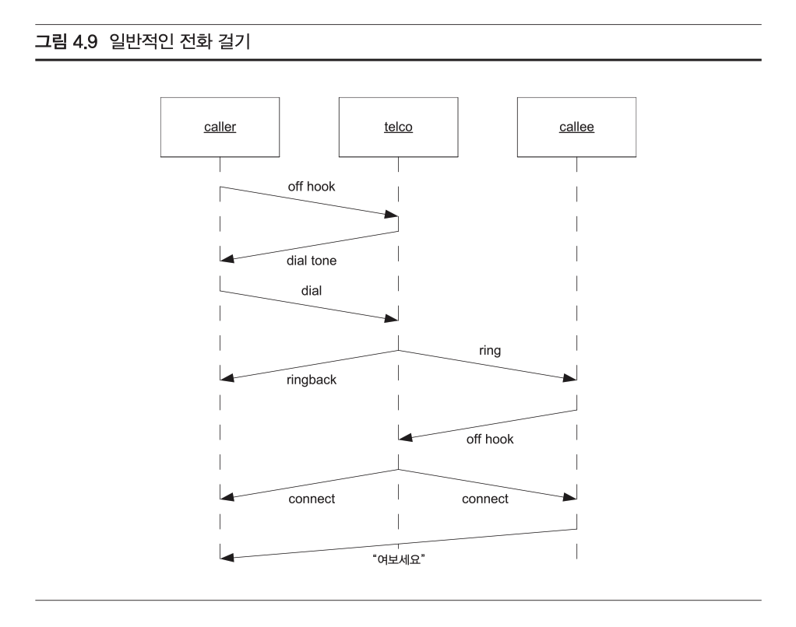

# 시퀀스 다이어그램

시퀀스 다이어그램은 객체 간의 상호작용을 시간 순서대로 나타내는 다이어그램이다. 시퀀스 다이어그램은 객체 간의 메시지 전달을 통해 시스템의 동작을 표현한다. 시퀀스 다이어그램은 시스템의 동작을 이해하는 데 도움이 된다.

언제 써야 할까?

**어떤 객체 그룹 안의 객체들이 어떻게 협력하는지 누군가에게 지금 바로 설명해야 할 때, 또는 여러분이 그 협력을 시각화해서 보고 싶을 때 시퀀스 다이어그램을 사용하라.**

#### 객체. 생명선, 메시지

- -협력에 참여하는 객체와 클래스는 맨 위.
- 객체는 이름 아래 밑줄이 있기 때문에 클래스와 구별. 왼쪽의 허수아비(액터)는 익명의 객체. 이 객체는 협력 과정에 들어오고 나가는 모든 메시지의 시작점이자 마지막점이다.
- 모든 시퀀스 다이어그램이 이런 익명 액터를 갖지는 않지만, 가지는 시퀀스 다이어 그램이 많다.


- 객체와 액터 아래로 늘어뜨린 점선은 **생명선**(lifeline)
- 한 객체에서 다른 객체로 보내는 메시지는 두 생명선 사이의 화살표로 그린다. 메시지마다 이름이 붙어 있다.
- 인자는 이름 뒤 괄호 안에 적거나, 데이터 토큰(반대쪽 긑에 원이 그려진 작은 화살표)아래에 적는다. 
- 시간이 아래쪽으로 흐르니까 메시지는 아래쪽에 있을 수록 나중에 보낸 것
- LoginServlet 객체의 생명선에 있는 얇은 사각형은 활성 상자(activation)
  - 꼭 그리지 않아도 되는 선택 사항이며, 대부분의 다이어그램에서 꼭 필요한 것은 아니다.
- EmployeeDB가 객체가 아니라 클래스라는 것. 클래스는 객체와 비슷하지만 이름에 밑줄이 없다. 그러므로 getEmployee 는 정적 메서드일 수밖에 없다.

```java
public class EmployeeDB {
	public static Employee getEmployee(String empid)
}
```


#### 생성과 소멸

- 관용적 표현을 사용하여 시퀀스 다이어그램에 어떤 객체의 생성을 표현할 수 있음.

- 그림을 보면 이름이 붙지 않는 메시지 화살표의 끝이 객체의 생명선이 아니라 생성될 객체를 가리킨다. ShapeFactory 는 다음과 같이 구현된다.

  ```java
  // ShapeFactory.java
  public class ShapeFactory {
    public Shape makeSquare() {
      return new Square();
    }
  }
  ```

- 자바에서 객체는 GC 가 우리 대신 객체를 소멸시키는데, UML 에서는 다음과 같이 표현한다.

  

  ```java
  public class TreeMap {
    private TreeNode topNode;
    public void clear() {
      topNode = null;
    }
  }
  ```

####  단순한 반복


- 시퀀스 다이어그램은 유용한 표기 습관이지만 사실 알고리즘을 시퀀스 다이어그램으로 나타내려고 노력하는 것은 그다지 현명하지 않다. 시퀀스 다이어그램은 객체 사이의 연결을 드러내기 위해 사용해야지, 알고리즘의 세부사항을 자세하게 보여 주기 위해 사용해서는 안된다.


#### 사례와 시나리오

규칙: 

- 아래와 같이 수많은 객체와 메시지로 가득 찬 시퀀스 다이어그램을 그리지 마라. 아무도 읽지 못하고 아무도 읽으려고 하지 않는다. 시간 낭비다. 대신 여러분이 하려는 일의 핵심만 집어서 더 작은 시퀀스 다이어그램을 여러 개 그리는 법을 익혀라.
- 시퀀스 다이어그램은 다이어그램을 설명하는 글을 위한 충분한 공간까지 포함해서 한 장에 다 들어가야 한다. 그렇다고 한 장에 다 들어가게 하려고 객체나 클래스 아이콘의 크기를 줄일 필요는 없다.


- 반대로 시퀀스 다이어그램을 몇십 장 몇백 장 그려도 안 된다. 너무 많아도 안읽는다.
- 모든 시나리오에서 공통으로 나오는 것을 찾아서 초점을 맞추어라. 'UML 다이어그램의 세계에서는 차이점보다 공통점이 휠씬 중요하다' 공통된 주제와 공통된 실천 방법을 보이기 위해 다이어그램을 사용하라. 
- 사소한 차이점까지 모두 문서를 만들려고 다이어그램을 사용하지마라.
- 메시지 흐름을 설명하기 위해 시퀀스 다이어그램을 꼭 그려야 한다면, 간결하고 절제해서 그려라.
-  **다이어그램을 되도록 적게 그려랴**


- 무엇보다 자신에게 시퀀스 다이어그램이 정말 필요한지 물어보아라.
- 만약 코드에서 표현력이 강하다면 시퀀스 다이어그램이 필요하지 않을 수 있다.

>정말 코드만으로 어떤 시스템의 일부분을 설명할 수 있을까? 사실 ‘그것이 개발자와 설계자의 목표여야 한다.’ 개발팀은 표현력이 강하고 가독성이 좋은 코드를 작성하기 위해 노력해야 한다. 코드만으로 설명하기 쉬울수록 필요한 다이어그램 의 수도 줄어들고, 전체 프로젝트도 나아질 것이다.

- 둘째, 만약 시퀀스 다이어그램이 필요하다는 생각이 들면, 그것을 여러 시나리오로 쪼갤 수 있는지 자신에게 물어보아라.
- 셋째, 여러분이 무엇을 그리려고 하는지 생각해 보아라.
  - 저차원과 고차원의 그림을 그리게 되는데, 대부분 고차원의 그림이 도움이 되더라.


####  고급 개념

##### 반복과 조건

잘 명시된 반복문과 if문장까지 완전히 갖춘 임금 지급 알고리즘. payEmployee 메시지는 그 앞에 다음과 같은 모양의 '반복' 표현문(recurrence expression)

`*[while id = idList.next()]`

별표(*)가 이것이 반복임을 가르쳐 준다.


**시간이 걸리는 메시지들**

- 보통 한 객체에서 다른 객체로 메시지를 보내는 데 걸리는 시간은 고려하지 않는다.




**비동기 메시지**

- 분산 시스템이나 멀티스레드 시스템 에서는 메시지를 보내는 객체가 메시지를 보낸 후 즉시 제어를 다시 받고, 메시지를 받는 객체가 다른 스레드의 제어 흐름에서 실행될 수도 있다. 이런 메시지는 ‘비동 기 메시지(asynchronous message)’라고 부른다.


- 화살표의 촉 안이 칠해져 있지 않고, 또 열렸음을 눈여겨보라. 이 장에서 지금까지 나온 시퀀스 다이어그램을 다시 한 번 보아라. 모두 (화살촉 속이 채워져 있는) 동기 메시지가 보일 것이다. 이렇게 화살촉의 미묘 한 변화만으로 다이어그램이 나타내는 행동에 커다란 차이가 생길 수 있다는 점이 UML의 우아함이다.

**다중 스레드**

- 비동기 메시지를 쓴다는 말은 곧 제어 흐름에서 다중 스레드를 사용한다는 뜻.
- 메세지 이름 앞에 **스레드 식별자** 붙여서 다른 스레드를 UML 다이어그램에서 표기


**활동적인 객체**

- 독립된 내부 스레드를 가진 객체를 표현하고 싶은 경우, 이런 객체는 활동적인 객체(active object)로 알려져 있는데, 다음과 같이 표기한다.


**인터페이스에 메시지 보내기**


**결론**

시퀀스 다이어그램은 객체지향 애플리케이션에서 메시지 흐름에 대해 다른 사람과 의사 소통하기 위한 강력한 방법. 그렇지만 남용하거나 과용하기 쉽다는 조언도 있다.

```
 꼭 필요할 때 칠판에 그린 시퀀스 다이어그램의 가치는 헤아릴 수 없다. 아주 작 은 종이에 어떤 하위 시스템에서 자주 보이는 상호 작용을 묘사하기 위해 시퀀스 다이어그램 대여섯 개를 그렸다면, 그 종이는 그 무게만 한 금만큼 가치가 있다. 반 면 다이어그램 천 개가 가득 그려진 문서라면 그 문서가 찍힌 종이만큼의 가치도 가지지 못하기 쉽다.

 개발자가 ‘코드를 작성하기 전에’ 모든 메서드의 시퀀스 다이어그램을 그려야 한 다는 생각은 1990년대의 소프트웨어 개발 방법론에서 가장 큰 오류다. 이 방법은 언제나 귀중한 시간을 무척 낭비하는 것으로 드러났다. 이렇게 하지 마라.
 
그 대신 시퀀스 다이어그램을 만든 의도대로 그것을 도구로써 사용하라. 칠판에 그릴 때는 실시간으로 의사 소통하기 위한 도구로 사용하라. 문서에 그릴 때는 시 스템에서 두드러지게 나타나는 핵심적인 협력을 포착하기 위해서 사용하라.

시퀀스 다이어그램은 너무 많은 것보다 너무 적은 것이 좋다. 나중에 필요하다면 언제든지 그때 가서 그릴 수 있다.
```

