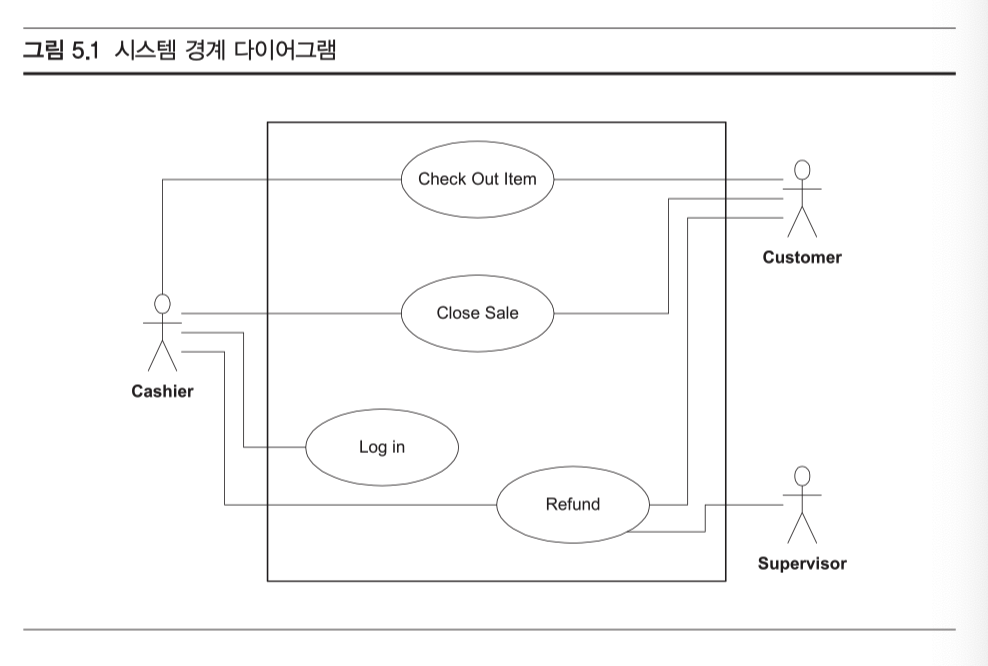

# 유스케이스

- 유스케이스는 훌룡한 아이디어로 시작했지만 나중에 괜히 엄청나게 복잡해진 경우다.

- 유스케이스를 작성하려고 자리에 앉아 시간만 질질 끄는 팀을 정말 많이 봤다.
- **이런 팀들은 본질보다는 형식에 관한 문제 때문에 계속 부딪힌다.**
  - '실제로는 정말 아무것도 아닌' 선행조건/후행조건/액터/2차 액터/ 그 밖에 작은 문제를 놓고 계속 논쟁

- 유스케이스를 '**단순하게 유지하는 것**'
  - 정해진 형식을 맞춰야 하나 걱정하지 말고 그냥 ‘빈 종이’에 쓰거나, 단순한 워드프 로세서로 ‘빈 페이지’에 작성하거나, ‘텅 빈 인덱스 카드’에 적어라.
  - 모든 세부사항을 채워야 하는지 걱정할 필요도 없다.
  - 세부사항은 휠씬 나중에야 중요해진다.
  - 모든 유스케이스를 포착할 수 있는지 걱정하지도 마라. 애초에 불가능한 일
  - 유즈케이스에서 유일하게 기억해야 할 점은 '**내일이면 다 바뀐다**'
  - 유스케이스를 ‘그때그때 작성하는 요구사항’이라고 생각하라.

#### 유스케이스 적기

- 우리는 유스케이스를 그리지 않고 글로 적는다.
- 유스케이스는 다이어그램이 아니다. **유스케이스는 특정 관점에서 보는 시스템의 동작을 글로 기술한 것**

#### 유스케이스란 무엇인가?

- 시스템의 동작 하나를 기술한 것. 유스케이스는 방금 시스템에 특정한 일을 시킨 사용자의 관점에서 작성하며, 사용자가 보낸 자극 '하나'에 대한 반응으로 시스템이 진행하는 '눈에 보이는'이벤트들의 흐름을 포착한다.
- `눈에 보이는` 이벤트란? 사용자가 볼 수 있는 이벤트. 유스케이스는 사용자의 눈에 보이지 않는 동작을 전혀 기술하지 않고 시스템 안의 숨겨진 메커니즘도 다루지 않는다. **오직 사용자가 직접 볼 수 있는 것을 적어 놓을 뿐이다.**

**기본 흐름**

- 구성은 보통 2개

  - 첫째 항목은 **기본 흐름(primary course)**

    - 사용자의 자극에 시스템이 어떻게 반응하는지 기술하는데 이때 아무것도 잘못되지 않는다고 가정한다.
    - 예를 들어, 판매시점관리(point of sale) 시스템의 전형적인 유스케이스를 보면
    - **상품을 구입하기**
      1. 점원은 상품을 스캐너 위로 통과시킨다. 스캐너가 UPC 코드를 읽는다
      2. 상품 가격과 설명이 지금까지 통과시킨 상품 가격의 합계와 함께 고객 쪽 화면에 표시된다. 가격과 설명은 점원의 화면에도 표시된다.
      3. 가격과 설명이 영수증에 출력된다.
      4. UPC 코드가 올바르게 읽혔는지 점원이 확인할 수 있도록 시스템이 잘 들리는 '승인'소리를 낸다.

    - 유스케이스의 세부사항을 기록하지 않는다면 '무엇을'기록해야 할까? 우리가 아무것도 기록하지 않는다면 유스케이스가 있는지조차 알지 못할 텐데? **유스케이스의 이름을 기록하라.** 유스케이스의 이름을 인덱스 카드에 적고 인덱스 카드 더미를 유지하는 것이 더 좋다. 구현할 때가 가까워지면 세부사항을 채워 넣는다.

  - **대체 흐름**

    - **UPC 코드를 읽지 못할 경우**
      - 스캐너가 UPC 코드를 읽는 데 실패하면, 시스템은 점원이 다시 시도하도록 "다시 통과시키시오." 소리를 낸다. 만약 세 번 시도했는데도 스캐너가 UPC 코드를 인식하지 못하면, 점원은 직접 코드를 입력해야 한다.
    - **UPC 코드가 없을 경우**
      - 상품에 UPC 코드가 없다면, 점원은 가격을 직접 입력해야 한다.
    - 이런 대체 흐름은 프로젝트 이해관계자가 미처 인식하지 못한 다른 유스케이스 에 대한 힌트를 주기 때문에 매우 흥미롭다. 이 간단한 경우에도 UPC 코드나 가격 을 수동으로 입력할 수 있어야 한다는 점이 새로이 드러났다.

- *하지만 늘 명심하라. 절대로 유스케이스를 적는 것 자체를 목적 으로 삼고 자리에 앉아 시간을 허비하지 마라.*

#### 유스케이스 다이어그램

유스케이스 다이어그램은 UML의 많은 다이어그램에서 가장 혼란스럽고 쓸모 없다. 그래서 소개할 다이어그램은 딱 하나.

**시스템 경계 다이어그램**

- 커다란 사격형이 시스템 경계. 사각형 안에 들어 있는 것은 모두 개발 중인 시스템의 일부. 사각형 바깥을 보면 시스템을 상대로 행동하는 액터를 볼 수 있다.
- 액터란? 시스템에 자극을 가하며 시스템 바깥에 있는 존재. 대게 사람이다. 하지만, 다른 시스템이나 심지어 실시간 클럭(realtime clock) 같은 장치가 액터가 될 수 있다.
- 유스케이스는 타원 안에 그 유스케이스의 이름을 써서 나타내고, 선으로 잇는다. 화살표로 그리지 마라. 화살표 방향이 정말로 무엇을 의미하는지 제대로 아는 사람은 아무도 없다.
- 이 다이어그램은 아예 쓸모없지는 않지만 쓸모없는 것과 마찬가지다. 자바 프로 그래머에게 도움이 될 정보는 거의 없지만, 프로젝트 이해관계자에게 프레젠테이션 할 때 멋진 표지로는 좋다.

**유스케이스 관계**

- 유스케이스 관게는 `그때는 참 좋은 생각으로 보였는데` 범주에 들어가는 아이디어다. 적극 무시하라.
- 전체 시스템을 이해하는 데도 하등 도움이 되지 않는다.

**결론**

주제가 단순하기 때문에 짧은 것이 당연하다. 여러분이 유스케이스 를 대할 때도 이렇게 단순하게 사용하려는 마음가짐을 가져야 한다. 자칫 복잡한 유스케이스라는 암흑의 길에 발을 들여놓는다면, 그것이 영원히 여러분의 운명을 지배할 것이다.

**그리고 유스케이스를 단순하게 유지하라**