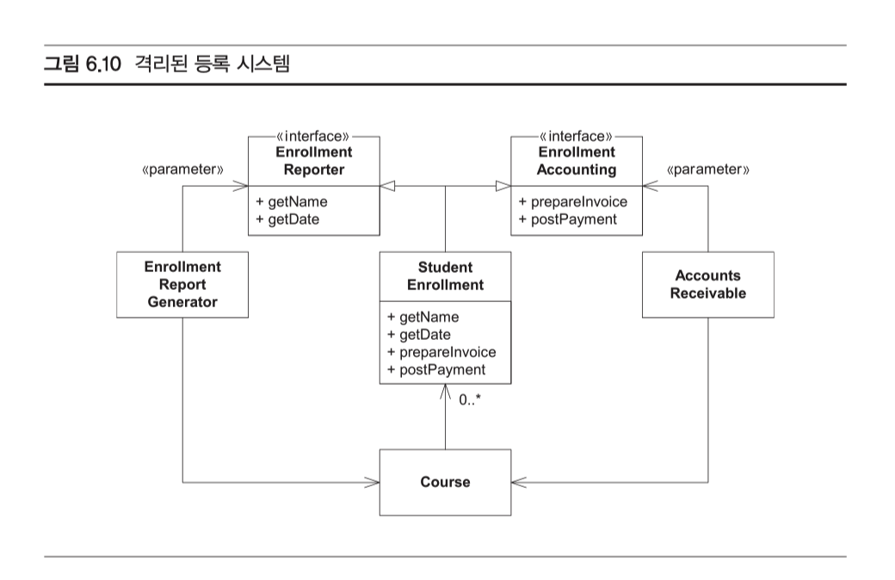

#### 객체지향 개발의 원칙

우리는 무엇을 발견하려고 UML 다이어그램을 읽는 것일까? 좋은 다이어그램인지 아닌지 평가하는 기준은 무엇일까?

코드 또는 다이어그램을 작성할 때 어떤 설계 원칙을 적용해야 할까?

##### 도움이 될 다섯 가지 설계 원칙

**설계의 품질**

잘 설계되었다는 말은 무슨 뜻일까? 잘 설계한 시스템은 이해하기 쉽고, 바꾸기도 쉽고, 재사용하기도 쉽다. 개발하는 데 특별히 어렵지도 않고, 단순하고 간결하며 경제적이다. 잘 설계한 시스템을 개발하는 일은 즐겁다. 반면, 잘못된 설계에서는 마치 썩은 고기처럼 역한 냄새가 난다.

**나쁜 설계의 냄새**

1. **경직성** - 무엇이든 하나를 바꿀 때마다 반드시 다른 것도 바꿔야 하며, 그러고 나면 또 다른 것도 바꿔야 하는 변화의 사실이 끊이지 않기 때문에 시스템을 변경하기 힘들다.
2. **부서지기 쉬움** - 시스템에서 한 부분을 변경하면 그것과 전혀 상관없는 다른 부분이 작동을 멈춘다.
3. **부동성** - 시스템을 여러 컴포넌트로 분해해서 다른 시스템에 재사용하기 힘들다
4. **끈끈함** - 개발 환경이 배관용 테이프나 풀로 붙인 것처럼 꽉 달라붙은 상태다
5. **쓸데없이 복잡함** - 괜히 머리를 굴려서 짠 코드 구조가 굉장히 많다. 이것들은 대개 지금 당장 하나도 필요 없지만 언젠가는 굉장히 유용할지도 모른다고 기대하며 만든 것이다
6. **필요 없는 반복** - 코드를 작성한 프로그래머 이름이 마치 '복사'와 '붙여넣기'같다.
7. **불투명성** - 코드를 만든 의도에 대한 설명을 볼 때 그 설명에 '표현이 꼬인다'라는 말이 잘 어울린다.

**의존 관계 관리하기**

잘못 관리한 의존 관계가 많은 냄새의 원인

- 잘못 관리한 의존 관계는 서로 단단하게 결합(coupling)하여 얽히고설킨 코드로 나타난다.
- 객체지향 언어는 의존관계를 관리하는 데 도움이 되는 도구를 제공.
  - 인터페이스를 만들어 의존 관계를 끊거나 의존의 방향을 바꿀 수도 있다.
  - 다형성을 사용하면 어떤 함수를 포함한 모듈에 의존하지 않고도 그 함수를 호출할 수 있다. 
  - 객체지향 언어는 의존 관계를 우리가 원하는 모양대로 만들 수 있는 강력한 힘을 준다.

**단 하나의 책임 원칙(Single Responsibility Principle)**

어떤 클래스를 변경해야 하는 이유는 오직 하나뿐이어야 한다.

- 클래스는 오직 하나만 알아야 한다. 오직 하나의 책임만 져야 한다. 더 핵심적인 말로 바꿔보면, 어떤 클래스를 변경해야 하는 이유는 오직 하나뿐이어야 한다.

위 코드를 보면 

- 임금과 세금을 계산하는 방법도 알고

- 자신을 디스크에 저장하거나 읽어 오는 방법도 안다.

- ...

**여기서 '부서지기 쉬움'냄새를 맡어야 한다.**

- 실제로는 이 모든 개념을 각기 다른 클래스로 분리하여 클래스마다 변경해야 하 는 이유가 오직 하나만 있도록 만드는 것이 바람직하다.

**개방-폐쇄 원칙(Open - Closed Principle)**

소프트웨어 엔티티(클래스, 모듈, 함수 등)는 확장에 대해서는 개방되어야 하지만, 변경에 대해서는 폐쇄되어야 한다.

**리스코프 교체 원칙(LSP)**

서브타입은 언제나 자신의 기반 타입(base type)으로 교체할 수 있어야 한다.

if 문장과 instanceof 표현식이 수없이 많은 코드를 본 적 있는가? 이런 표현식을 사용하는 것이 올바른 경우도 있지만, 아주 드물다. 보통 이런 코드는 LSP를 지키지 않아서 생기는데, 이는 곧 OCP도 지키지 않았다는 말이다.

LSP에 따르면, 기반 클래스(base class)의 사용자는 그 기반 클래스에서 유도된 클래스를 기반 클래스로써 사용할 때, 특별한 것을 할 필요 없이 마치 원래 기반 클래스를 사용하는 양 그대로 사용할 수 있어야 한다.

더 자세히 말하자면, instanceof 나 다운캐스트(downcast) 를 할 필요가 없어야 한다. 

- 사용자 파생 클래스에 대해서 아무것도 알 필요가 없어야 한다. 파생 클래스가 있다는 사실조차도.

예시.

만약 추상 클래스 Employee 가 있고, calcPay 라는 메소드가 존재한다.

월급을 받는 Salaried Employee 는 calcPay 를 구현하면 되고, Hourly Employee 는 이 메서드를 이번 주 출퇴근 카드에서 알아낸 근무 시간 수 곱하기 시간당 임금을 리턴하도록 구현할 것이다.

 그렇다면 VolunteerEmployee(자원 봉사 직원)를 추가하기로 결정한다면 VolunteerEmployee 클래스는 calPay 를 어떻게 구현해야 할까?

**시도해볼만한 것**

- calcPay 반환값을 0으로 만드는 행위 - LSP 를 위반

- 예외를 발생시키는 것 - LSP 를 위반
- instanceOf 를 사용하는 행위 - LSP 를 위반

내가 생각하는 정답은? 

- Employee 위에 상위 인터페이스 Person 만들기. 
- Person 과 Calcuable 인터페이스 만들기

명확하게 돈을 받는 직원과 자원봉사자를 분리하는 것이 LSP 를 위반하지 않는 것이다.

OCP 또는 SRP 를 지키기 위해서는 어떻게 해볼 수 있을까?

- 전략패턴과 템플릿 메서드 패턴을 활용해볼 수 있다.

**의존 관계 역전 원칙(DIP)**

A. 고차원 모듈은 저차원 모듈에 의존하면 안 된다. 이 두 모듈 모두 다른 추상화된 것에 의존해야 한다.

B. 추상화된 것은 구체적인 것에 의존하면 안 된다. 구체적인 것이 추상화된 것에 의 존해야 한다.

더 쉽게 ‘자주 변경되는 컨크리트 클래스(concrete class)에 의존하지 마라.’ 만약 어떤 클래스에서 상속받아야 한다면, 기반 클래스를 추상 클래스로 만들어라. 어떤 클래스의 참조(reference)를 가져야 한다면, 참조 대상이 되는 클래스를 추상 클래스로 만들어라. 만약 어떤 함수를 호출해야 한다면, 호출되는 함수 를 추상 함수로 만들어라.

**그럼 String 은? 이건 사용하면 안되나? 그렇지 않다. 앞으로 변경되지 않을 컨크리트 클래스에 의존하는 것은 완벽하게 안전하다.**

 우리가 의존하면 안되는 것은 '자주 변경되는' 컨크리트 클래스다. **활발히 개발 중인 컨크리트 클래스나 변할 가능성이 높은 비즈니스 규칙을 담은 클래스가 여기 에 속한다. 이런 클래스의 인터페이스를 만든 다음, 이 인터페이스에 의존하는 것이 바람직하다.**

**인터페이스 격리 원칙(ISP)**

클라이언트는 자신이 사용하지 않는 메서드에 의존 관계를 맺으면 안 된다.

비대한 클래스가 거대하고 보기 흉하다는 사실 말고도, 한 사용자가 이 비대한 클래스의 메서드를 다 사용하는 일이 매우 적다는 것도 문제다. 즉, 메서드를 몇십 개 선언한 클래스에서 사용자는 단지 두세 개만 호출할지도 모른다. 불행하게도 이 사용자들은 ‘호출하지도 않는’ 메서드에 생긴 변화에서도 영향을 받는다.

**왜?**

​	**문제점 1: 호출하지 않는 메서드에 대한 변경 사항으로 인한 컴파일 및 배포 문제**

​	•	예를 들어, 누군가가 recordAttendance 메서드를 수정하거나 새로 추가한다고 가정해 봅시다. 비록 당신은 이 메서드를 호출하지 않지만, 그 메서드의 변경으로 인해 클래스 자체가 변경됩니다.

​	•	이러한 변경은 프로젝트 전체를 다시 **컴파일**하고 **배포**해야 할 가능성을 높입니다. 당신은 calculateSalary만 사용하고 있지만, 전체 클래스가 변경되었기 때문에 재배포 과정에서 불필요한 영향을 받을 수 있습니다.

​	•	**문제점 2: API 변경으로 인한 의도치 않은 영향**

​	•	만약 recordAttendance의 메서드 시그니처가 변경되거나 제거되면, 이를 사용하는 다른 사용자들에게 문제가 발생할 수 있습니다. 비록 당신은 이 메서드를 사용하지 않지만, 클래스 자체가 변경되었으므로 코드베이스 전반에 영향을 미칠 수 있습니다.

​	•	즉, 당신의 코드는 calculateSalary만 사용하고 있지만, 다른 메서드에서 발생한 오류나 문제 때문에 전체 시스템의 안정성이 위협받을 수 있습니다.

​	•	**문제점 3: 테스트와 유지보수**

​	•	비대한 클래스는 단일 책임을 벗어난 기능들을 많이 포함하고 있으므로, 하나의 작은 변화라도 전체 시스템의 다른 부분을 예기치 않게 망가뜨릴 수 있습니다.

​	•	따라서 모든 메서드를 테스트해야 하며, 이로 인해 테스트 범위가 넓어지고 유지보수 비용이 증가합니다. 당신이 필요로 하는 기능만 테스트하고 싶어도, 비대한 클래스의 특성상 다른 메서드가 영향을 미칠 수 있기 때문에 전체 테스트를 다시 해야 할 가능성이 큽니다.

**3. ‘호출하지 않는 메서드의 변화’가 주는 영향**

비록 당신이 특정 메서드를 호출하지 않는다 해도, 그 메서드가 포함된 클래스 전체가 변경될 때는 **간접적으로** 영향을 받을 수 있습니다. 다음과 같은 이유로 영향이 발생합니다:

​	•	**클래스의 버전 관리 문제**: 호출하지 않는 메서드가 변경되면 클래스의 버전이 변경됩니다. 이를 사용하는 모든 클라이언트 코드도 그 변화를 인식해야 하며, 해당 클래스의 새로운 버전을 참조하도록 수정해야 할 수 있습니다.

​	•	**의존성 관리**: 호출하지 않는 메서드가 추가되거나 수정되면, 그 클래스가 포함된 모듈이나 패키지가 다시 빌드되어야 할 수 있습니다. 이를 사용하는 다른 클래스들도 다시 컴파일되어야 하고, 시스템 전체에 대한 의존성 문제를 야기할 수 있습니다.

​	•	**유지보수 복잡성 증가**: 비대한 클래스는 코드 복잡성을 증가시키며, 그로 인해 새로운 변경이 있을 때 예상치 못한 사이드 이펙트가 발생할 가능성이 커집니다.

다시 아래 문제로 돌아갓,

EnrollmentReportGenerator 는 prepareInvoice, postPayment 를 사용하지 않는다는 것이 명백하다.

AccountsReceivable 은 getname, getDate 사용하지 않는다는 것이 명백하다.

그런데, 이때 요구사항이 변경되어, postPayment 메서드에 새 인자를 추가할 수 밖에 없다면 어떤일이 일어날까?

**EnrollmentReportGenerator 다시 컴파일하고 배포해야 할지도 모른다.**

그럼 어떻게 해결해야 할까?

**중간에 interface 를 제공해서 필요하지 않는 메서드에서 사용자를 보호하라.**

StudentEnrollment 객체를 사용하는 사용자마다 자신이 관심 있는 메서드들만 있는 인터페이스를 제공받는다. 이렇게 하면 사용자가 관심 없는 메서드에서 생긴 변화에서 사용자를 보호할 수 있다. 그리고 사용자가 자신이 사용하는 객체를 너 무 많이 알게 되는 일도 막을 수 있다.

마지막...

그럼 위 5가지 원칙을 무조건 지켜야할까?

 언제 이 원칙들을 적용해야 할까? 조금이라도 고통을 느끼기 시작하면 바로 해야 한다. 전체 시스템이 언제나 모든 원칙을 따르게끔 노력하는 것은 현명하지 못하다. 

- OCP를 적용할 상이한 환경을 모두 상상하거나 SRP를 적용할 모든 변경의 이유 를 생각해 내려면 시간이 끝도 없이 걸릴 것이다. 
- ISP를 지키기 위해서 자잘한 인터 페이스를 몇십 몇백 개 만들게 될 테고
- DIP를 지키기 위해 쓸모없는 추상을 무수히 만들게 될 것이다.

그러므로, 가장 좋은 방법은 능동적으로 적극 적용하는 것이 아니라, 문제가 생겼을 때 그에 대한 '반응으로써 적용'하는 것이다. 코드의 구조적인 문제를 처음 발견했거나, 어떤 모듈이 다른 모듈에서 생긴 변화에 영향을 받음을 처음 깨달았을 때 그때 '비로소'원칙 가운데 하나 또는 여러 개를 써서 이 문제를 해결할 수 있는지 알아보아야 한다.

 이렇게 문제가 생겨야 비로소 반응하는 접근 방법을 쓰기로 한다면, 초기 에 고통을 느낄 수 있도록 시스템에 ‘적극적으로’ 압력을 가해야 한다. 어디가 아픈 지 부지런히 눌러 봐야 문제들을 충분히 발견할 수 있기 때문이다.

단위 테스트를 엄청나게 작성해 보는 것이 아픈 지점을 찾는 가장 좋은 방법 가 운데 하나다.