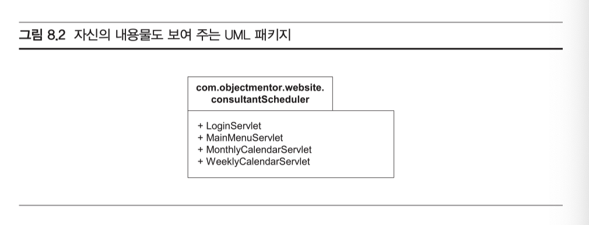
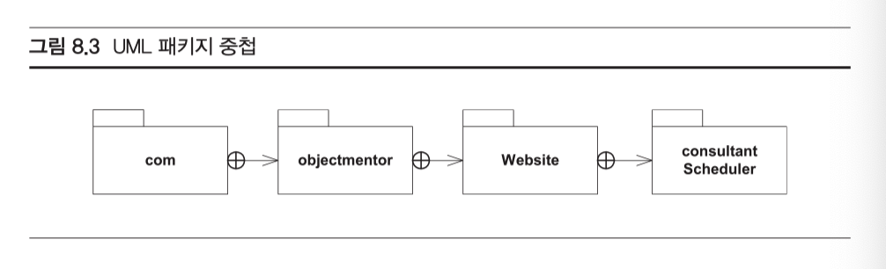
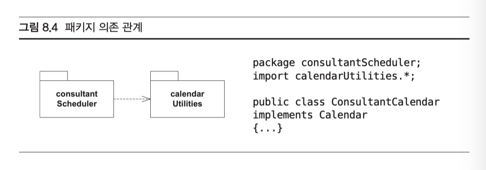

# 패키지

자바 프로그래머에게 중요한 패키지는 두 종류

1. 자바의 package 키워드로 나타내는 소스코드 패키지
2. 다른 하나는 .jar 파일로 나타내는 바이너리 컴포넌트

### 자바패키지

- 자바 패키지는 본질적으로 이름 공간(namespace)
- 패키지를 사용하면 프로그래머가 작은 개인 공간을 만들어 그안에 클래스 선언. 이 공간에서 만든 클래스들은 다른 패키지에 있는 똑같은 이름의 클래스와 이름 충돌(name collision)을 일으키지 않는다.
- 자바의 컴파일 시스템은 소스코드의 패키지 구조를 본떠 만든 디렉터리 구조 안에 생성한 이진 .class 파일들을 보관.

#### **UML 패키지**

- UML에서 패키지는 여러 가지 방식으로 표기할 수 있다.
- 가장 간단한 방법은?

- 원한다면 사각형 위에 있는 이름표에 패키지 이름을 적을 수도 있다. 나머지 사각형이 비게 되므로 여기에 클래스 이름을 모두 또는 일부 적을 수도 있다.

- 패키지의 중첩 구조는 '포함 관계(contains relationship)'로 표현

#### 의존관계

- 어떤 패키지 내부의 코드가 다른 패키지에 속한 코드에 의존하는 경우
- 자바에서는 한 클래스 또는 여러 클래스를 우리 소스코드에 임포트(import) 할 때가 이런 경우. 소스코드에서 어떤 클래스를 완전한 형태의 이름으로 사용한다고 해도 마찬가지.

import 문장때문에 의존관계가 생기기보다는 정말 사용해야만 의존관계가 생긴다.

#### 바이너리 컴포넌트 - .jar 파일

패키지는 소스코드를 그룹으로 묶을 때라면 편리하지만, 그렇다고 해서 바이너리 코드를 그룹으로 묶을 때도 늘 편리하진 않다. 이따금 .jar 파일의 형태로 많은 바이너리 코드를 한데 묶어 컴포넌트로 만들고 싶을 때가 있다. 

- **이런 컴포넌트는 이것을 실행할 여러 시스템에 배포할 때 편리**

## 패키지 설계의 원칙

- 이 원들은 반드시 지켜야 하는 규칙이 아니며, '언제나 올바른 방법'도 아니다. 이것은 오히려 어떤 시스템을 여러 부분으로 나눌 때 고려해야 할 여러 트레이드 오프(trade-off)를 올바로 하게끔 도와주는 단순한 휴리스틱(heuristics)에 가깝다.

  **이 원칙들을 따르면 기능을 기준으로 시스템을 나누지 않게 된다.**

- 이 원칙에 따라 나뉜 패키지의 목적은 자주 변경하는 클래스를 따로 모으고, 변경할 이유가 다른 클래스를 갈라놓는 것.