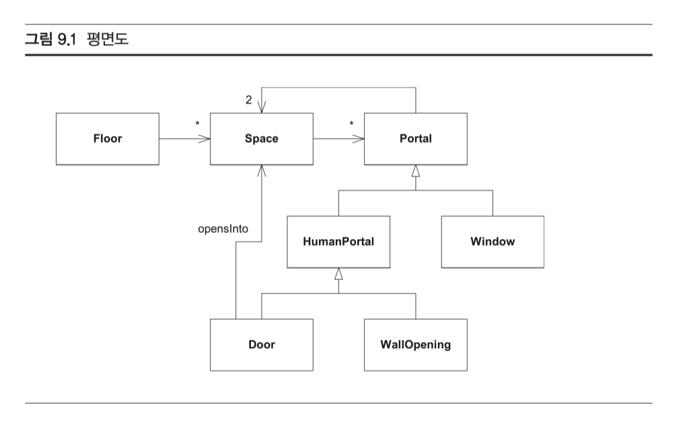
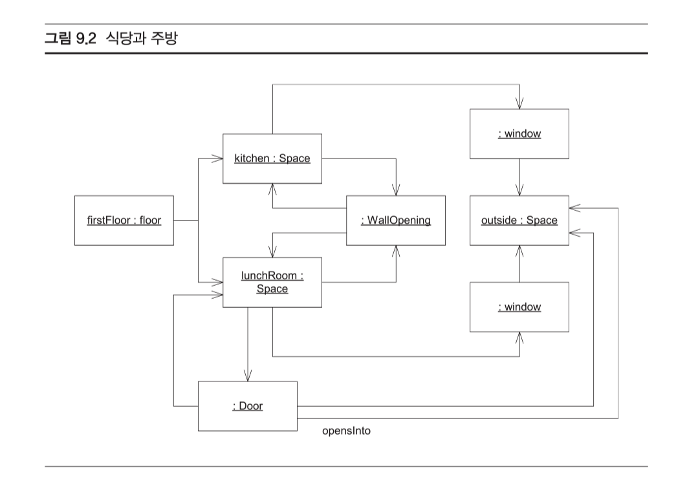
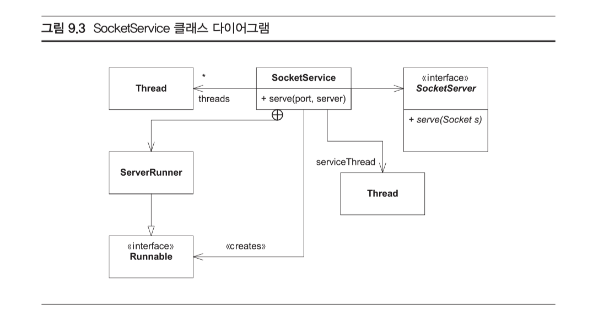
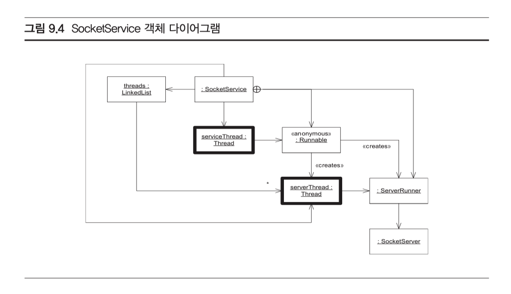

### 객체 다이어그램이란 무엇인가?

**특정 순간의 시스템 상태를 보이는 것이 유용한 경우**

시스템의 시냅샷 사진처럼, UML 객체 다이어그램은 어떤 순간의 객체들과 그 객체 사이의 관계 그리고 그 객체들의 속성 값을 보여준다.

#### 어떤 순간의 스냅샷

이 클래스 다이어그램에서 어떤 데이터 구조를 만들 수 있는지는 알 수 있지만, 어떤 순간에 정확히 어떤 객체들과 관계들이 인스턴스화되어 있는지는 알 수 없다.

아래는 객체 다이어그램을 그린 것

 지금 시스템에 있는 객체들과, 이것에 연결된 다른 객체들을 볼 수 있다. 여기에서 주방(kitchen)과 식당(lunchRoom) 모두 공간(Space) 클래 스의 인스턴스임을 알게 된다. 두 방이 통로(wall opening)로 연결되어 있고 바깥 (outside)도 사실은 공간(Space)의 또 다른 인스턴스로 표현됨도 볼 수 있다. 그리고 반드시 있어야 하는 나머지 객체들과 관계들도 보인다.

### 활동적인 객체

다중 스레드를 사용하는 시스템도 객체 다이어그램이 유용하다. 어떻게?

SockerService(소켓 서비스) 코드를 한번 살펴보자.

코드의 클래스 다이어그램은 다음과 같다.

위 클래스 다이어그램을 본다고 이해가 될까?

SocketService(소켓 서비스)객체가 serviceThread(서비스 스레드)를 가지며, 이 서비스 스레드가 익명 내부 클래스 안에 돌아감을 볼 수 있다. 그리고 서비스 스레드에 모든 ServerRunner(서버 실행자)인스턴스들을 생성하는 책임이 있음도 볼 수 있다.

 객체는 ‘활동적인 객체(active object)’를 나타낸다. 활동적인 객체는 스레드의 사령 부 역할을 하며, 그 스레드를 제어하는 메서드들, 예를 들어 시작(start), 멈춤(stop), 우선순위 설정(setPriority) 등을 가진다. 이 다이어그램에서 모든 활동적인 객체는 Thread의 인스턴스인데, 이는 Thread의 인스턴스가 참조를 가지는 Runnable 유도 객체에서 모든 작업을 처리하기 때문이다. Runnable 유도 객체 자체는 활동적인 객 체가 아닌데, 그 까닭은 이것들이 스레드를 제어하지 않기 때문이다. 오히려 스레드 가 이 객체들의 메서드를 호출해서 사용한다.

**결론**

다이어그램 - *특정 순간의 시스템 상태를 찍은 스냅샷*

객체 다이어그램은 시스템을 그림으로 설명하는 유용한 방법, 시스템의 구조를 그 시스템에 속한 클래스의 정적인 구조에서 만들어 내는 것이 아니라 **동적으로 만드는 경우 유용.**

