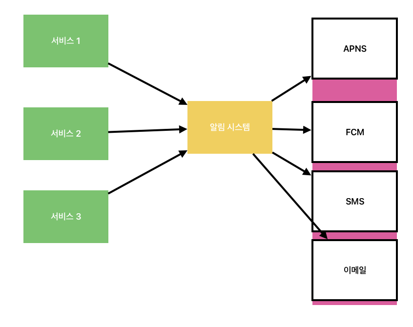

# 알림 시스템 설계

---

### 알림 시스템 설계

알람 시스템은 단순히 모바일 푸시 알림에 한정된 것이 아니라, 이메일, SMS 메세지등으로 분류하여 알림 발송

---

### 1단계.문제 이해 및 설계 범위 확정

 어떤 요구사항이 있을 수 있을까?

 - 어떤 종류의 알림?
 - 실시간 시스템이여야 하는가?
 - 어떤 종류의 단말기를 지원하는지?
 - 사용자에게 보낼 알람은 누가 만들 수 있는가?
 - 사용자가 알림을 받지 않도록(opt-out) 설정
 - 하루에 몇 건의 알림을 보낼 수 있어야 하나?

 이러한 질문을 통해 요구사항을 알아내고 모호한 부분 제거한다.

---

### 2단계. 개략적 설계안 제시 및 동의

---

고려해야 될 점과 문제점

- 확장성
    = 새로운 서비스를 통합하거나 기존 서비스를 제거할 수 있어야 하는데 가능한가?
- SPOF(Single-Point Of Failure)
    = 알림 시스템
- 규모 확장성
    = 한 대 서비스로 푸시 알림에 관계된 모든 것을 처리하므로, DB나 캐시 등 중요 컴포넌트의 규모를 개별적으로 늘릴 방법이 없다.
- 성능 병목

그래서 다음과 같이 개선

---

---

### 3단계 상세 설계

- 안정성(reliability)
- 추가로 필요한 컴포넌트 및 고려사항: 알람 템플릿, 알림 설정, 전송률 제한, 재시도 메커니즘, 보안, 큐에 보관된 알림 모니터링, 이벤트 추적
- 개선된 설계안

---

**안전성**

분산 환경에서 운영될 알림 시스템을 설계할 때는 안정성을 확보하기 위한 사항 몇가지 반드시 고려

- 데이터 손실방지
- 알림 중복 전송 방지

---

**추가로 필요한 컴포넌트 및 고려사항**

- 알림 템플릿
- 알림 설정
- 전송률 제한
- 재시도 방법
- 푸시 알림과 보안
- 큐 모니터링
- 이벤트 추적

---

**이벤트 추적 ?**

---

수정된 설계안

---
- 알림 서버에 인증과 전송률 제한 기능 추가
- 전송 실패에 대응하기 위한 재시도 기능 추가. 전송에 실패한 알림은 다시 큐에 넣고 지정된 횟수만큼 재시도
- 전송 템플릿 사용하여 알림 생성 과정 단순화하고 알림 내용 일관성 유지
- 모니터링과 추적 시스템을 추가하여 시스템 상태 확인
