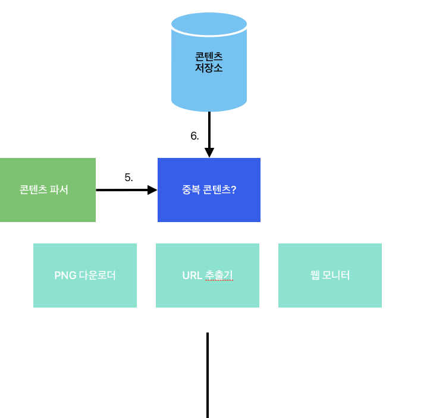

# 웹 크롤러 설계

---
사용처

- 검색 엔진 인덱싱(search engine indexing)
- 웹 아카이빙(web archiving)
- 웹 마이닝(web mining)
- 웹 모니터링(web monitoring)

---

<h1>
로봇 또는 스파이더라고 부르고, 검색 엔진에서 널리 쓰는 기술. 

웹에 새로 올라오거나 갱신된 콘텐츠를 찾아내는 것이 주된 목적
<h1>

---

### 문제 이해 및 설계 범위 확정

기본 알고리즘
1. URL 집합이 이력으로 주어지면, 해당 URL들이 가리키는 모든 웹페이지 다운로드
2. 다운받은 웹 페이지에서 URL 추출
3. 추출된 URL들을 다운로드할 URL 목록 추가 후, 위 과정 반복

단순할까? 엄청난 규모 확장성을 갖는 웹 크롤러를 설계하는 것은 어려운 작업. 주어진 인터뷰 시간 동안 완성하기는 불가능할 것. 그러니 설계를 진행하기 전에 질문을 던져 요구사항 파악

---

 어떤 요구사항이 있을 수 있을까?

 - 주된 용도는 어떤 것?
 - 매달 얼마나 많은 웹 페이지 수집?
 - 수집된 웹 페이지는 얼마나 보관해야 하나?
 - 중복된 콘텐츠는 어떻게 해야 하나?

 이러한 질문을 통해 요구사항을 알아내고 모호한 부분 제거한다.

---

 좋은 웹 크롤러가 가져야하는 특징

- 규모 확장성
    = 웹은 거대. 병행성(parallelism) 활용
- 안전성(robustness)
    = 비정상적인 입력이나 환경에 잘 대응
- politeness(예절)
    = 크롤러는 수집 대상 웹 사이트에 짧은 시간 동안 너무 많은 요청을 보내서는 안된다.
- 확장성(extensibility)
    = 새로운 형태의 콘텐츠를 지원하기가 쉬워야 한다.

---

## 2단계 개략적 설계와 동의 구하기

---

1. 시작 URL들을 미수집 URL 저장소에 저장
2. HTML다운로더는 미수집 URL 저장소에서 URL 목록 가져옴
3. HTML 다운로더는 도메인 이름 변환기를 사용해 URL의 IP 주소 알아내고 해당 IP 주소로 접속하여 웹 페이지 다운로드
4. 콘텐츠 파서는 다운된 HTML 페이지를 파싱하여 올바른 형식을 갖춘 페이지인지 검증
5. 콘텐츠 파싱과 검증이 끝나면 중복 콘텐츠인지 확인하는 절차 개시
6. 중복 콘텐츠인지 확인하기 위해, 해당 페이지가 이미 저장소에 있는지 확인
    - 이미 저장소에 있는 콘텐츠인 경우 처리하지 않고 버린다.
    - 저장소에 없는 콘텐츠인 경우 저장소에 저장한 뒤 URL 추출기로 전달

---

7. URL 추출기는 해당 HTML 페이지에서 링크 골라낸다.
8. 골라낸 링크를 URL 필터로 전달
9. 필터링이 끝나고 남은 URL만 중복 URL 판별 단계로 전달
10. 이미 처리한 URL인지 확인하기 위해, URL 저장소에 보관된 URL인지 확인 후, 이미 저장되 있다면 URL 버린다.
11. 저장소에 없는 URL은 URL 저장소에 저장할 뿐 아니라 미수집 URL 저장소에도 전달

---

## 상세 설계

여기가 핵심

요구사항을 충족하기 위한 컴포넌트와 구현 기술

- DFS(Depth-First search)vs BFS(Breadth-First Search)
- 미수집 URL 저장소
- HTML 다운로더
- 안정성 확보 전략
- 확장성 확보 전략
- 문제 있는 콘텐츠 감지 및 회피 전략

---

#### DFS(Depth-First search)vs BFS(Breadth-First Search)

대부분 너비 우선 탐색법을 사용. 깊이 우선 탐색법을 사용할 경우, 그 깊이를 가늠하기 어렵기 때문(?) 상대적으로 너비 우선 탐색보다는, BFS 는 대부분 큐로 FIFO 큐를 사용하는데, 두 가지 문제점이 있다

1. 예의 없는(impolite) 크롤러
2. BFS 알고짐은 URL 간에 우선순위를 두지 않는다. 처리 순서에 있어 모든 페이지를 공평하게 대우하는데, 모든 웹 페이지가 같은 수준의 품질, 중요성을 갖지 않고 페이지 순위, 사용자 트래픽 양, 업데이트 빈도 등 여러가지 척도에 비추어 처리 우선순위를 구별

**위 2가지 문제점은 어떻게 해결할 수 있을까?**
= 바로 미수집 URL 저장소

---

#### 미수집 URL 저장소

URL 저장소는 다운로드할 URL을 보관하는 장소. 이 저장소를 잘 구현하면 해결가능.

- politeness
- freshness

동일 웹 사이트에는 한 번만 요청. 같은 웹 사이트의 페이지를 다운받는  태스크는 시간차를 두고 실행해야 하는데, 이 문제를 어떻게 해결할까?

---

.

- 큐 라우터: 같은 호스트에 속한 URL은 언제나 같은 큐로 가도록 보장하는 역할
- 매핑 테이블: 호스트 이름과 규사이의 관계를 보관하는 테이블
- FIFO 큐: 같은 호스트에 속한 URL은 언제나 같은 큐에 보관
- 큐 선택기
- 작업 스레드

---

#### 우선순위

URL의 우선순위를 나눌 때는 페이지랭크(PageRank), 트래픽 양, 갱신 빈도(update frequency) 다양한 척도 사용.

---

- 순위결정장치: URL을 입력으로 받아 우선순위 계산
- 큐(f1 ... fn): 우선순위별로 큐를 하나씩 할당. 우선순위가 높으면 선택될 확률 올라간다.
- 큐 선택기: 임의 큐에서 처리할 URL을 꺼내는 역할. 순위가 높으면 큐에서 더 자주 꺼내도록 프로그램됨

### 궁금한 부분. 어떻게 우선 결정장치를 만들 수 있지?

---

##### 신선도

- 웹 페이지의 변경 이력(update history) 활용
- 우선순위를 활용하여, 중요한 페이지는 좀 더 자주 재수집

#### HTML 다운로더

HTML 다운로더는 HTTP 프로토콜을 통해 웹 페이지를 내려받는다. 다운로더에 대해 알아보기 전에 먼저 제외 프로토콜부터 살펴보고 넘어가자.

---

#### Robots.txt

로봇 제외 프로토콜 이해가 필요

User-agent: Googlebot
Disallow:/creatorhub/*
Disallow:/creatorhub/*

Robots.txt 중요하고, 성능최적화도 중요.

---

**성능 최적화**

1. 분산 크롤링
성능을 높이기 위해 크롤링 작업을 여러 서버에 분산하는 방법. 각 서버는 여러 스레드를 돌려 다운로드 작업 처리
2. 도메인 이름 변환 결과 캐시
3. 지역성
4. 짫은 타임아웃

---

**안정성**

= 최적화된 성능뿐 아니라 안정성도 다운로더 설계시 중요하게 고려.

- 안정 해시(consistent hashing)
- 크롤링 상태 및 수집 데이터 저장
- 예외 처리(exception handling)
- 데이터 검증(data validation)

---

**확장성**

---

**문제 있는 콘텐츠 감지 및 회피**

1. 중복 콘텐츠
해시나 체크섬을 사용하면 중복 콘텐츠를 보다 쉽게 탐지

2. 거미 덫
 크롤러를 무한 루프에 빠뜨리도록 설계한 웹 페이지.

 3. 데이터노이즈
 ex. 광고나 스크립트 코드, 스팸 URL 같은 내역은 필요 X
