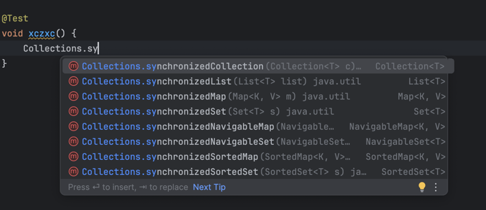

# 5. 구성단위

## 5.1 동기화된 컬렉션 클래스

대표주자는 Vector와 HashTable. Collections.synchronizedList, Collections.synchronizedMap 등이 있다.



### 1.1 동기화된 컬렉션 클래스의 문제점

동기화된 컬렉션 클래스는 여러 스레드가 동시에 접근할 수 있도록 해준다. 하지만 이런 클래스를 사용하면서 발생하는 문제점이 있다. 

```java
Vector<E> list = new Vector<E>();

public static Object getLast(Vector list) {
    int lastIndex = list.size() - 1;
    return list.get(lastIndex);
}

public static void deleteLast(Vector list) {
    int lastIndex = list.size() - 1;
    list.remove(lastIndex);
}
```

위와같은 메소드가 있을 때는 올바르게 동작하지 않을 수 있다.

하나의 스레드에서는 getLast 하나는 deleteLast를 호출하고 있다. getLast가 호출되는 동안 다른 스레드가 deleteLast를 호출하면 문제가 발생한다. 당연히 예외가 발생하는 것이 맞을 수 있으나, **getLast 메소드를 호출하는 입장에서는 가져가고자 했던 '마지막' 값이 들어 있음에도 불구하고 가져가지 못했기 때문에 올바르지 않은 상황이다.**

그럼 어떻게?
```java
Vector<E> list = new Vector<E>();

public static Object getLast(Vector list) {
    synchronized (list) {
        int lastIndex = list.size() - 1;
        return list.get(lastIndex);
    }
}

public static void deleteLast(Vector list) {
    synchronized (list) {
        int lastIndex = list.size() - 1;
        list.remove(lastIndex);
    }
}
```
 클라이언트 측 락을 활용해 해결할 수 있다. 하지만 이런 방법은 코드가 복잡해지고, 락을 잘못 사용하면 데드락이 발생할 수 있다.

### 5.1.2 ConcurrentModificationException

동기화된 컬렉션 클래스를 사용하면서 발생하는 문제점 중 하나는 ConcurrentModificationException 이다. 이 예외는 컬렉션을 동시에 수정하려고 할 때 발생한다. 

```java
 List<Widget> widgetList = Collections.synchronizedList(new ArrayList<Widget>());

...
// ConcurrentModificationException 발생할 수 있다.
for(Widget w : widgetList) {
 doSomething(w);
}
```

### 5.1.3 숨겨진 Iterator

락을 걸어 동기화시키면서 Iterator 를 사용하면 ConcurrentModificationException 발생하지 않도록 막을 수는 있지만 ,컬렉션을 공유해 사용하는 모든 부분에서 동기화를 맞춰야 한다는 점은 잊어서는 안됨.


## 5.2 병렬 컬렉션

자바 5부터는 병렬 컬렉션을 제공한다. 병렬 컬렉션은 컬렉션의 일부 메소드를 동시에 실행할 수 있도록 해준다.

이전의 동기화된 컬렉션 클래스는 컬렉션의 내부 변수에 접근하는 통로를 일련화해서 스레드 안전성을 확보했다. 하지만 이렇게 만들다 보니 여러 스레드가 한꺼번에 동기화된 컬렉션을 사용하려고 하면 동시 사용성은 상당 부분 손해를 볼 수밖에 없다.

 하지만 병렬 컬렉션은 여러 스레드에서 동시에 사용할 수 있도록 설계 5.0 에서 HashMap 을 대치하면서 병렬성을 확보한 ConcurrentHashMap 이 있다. ConcurrentMap 의 인터페이스를 보면 put-if-absert 연산, replace 연산, conditional remove 연산 등을 정의.

그 외에도 ConccurentHashMap 클래스가 해시 기반의 동기화된 Map의 발전된 형태인 것처럼, 자바6에는 ConcurrentSkipListMap과 ConcurrentSkipListSet이라는 클래스가 있으며, SortedMap과 SortedSet의 병렬성을 높이도록 발전된 형태.

### 5.2.1 ConcurrentHashMap

동기화된 컬렉션 클래스는 각 연산을 수행하는 시간 동안 항상 락을 확보하고 있어야 한다. ConcurrentHashMap은 HashMap과 같이 해시를 기반으로 하는 Map이다. 내부적으로는 이전에 사용하던 것과 전혀 다른 동기화 기법을 채택하여 병렬성과 확장성이 나아진다.

이전에는 모든 연산에서 하나의 락을 사용했기 때문에 특정 시점에 하나의 스레드만이 해당 컬렉션을 사용할 수 있었다. 하지만 ConcurrentHashMap은 lock striping 이라 부르는 굉장히 세밀한 동기화 방법을 사용해 여러 스레드에서 공유하는 상태에 잘 대응.

참고자료 - [Java 코드로 보는 Lock Striping 과 ConcurrentHashMap, CAS (Compare-And-Swap)](https://liltdevs.tistory.com/166)

 값을 읽어가는 연산에도 동시에 많은 스레드에서 처리할 수 있고, 읽기/쓰기 연산도 동시에 처리할 수 있다.

ConcurrentHashMap에서 만들어 낸 Iterator는 즉시 멈춤(fail-false) 대신 **미약한 일관성 전략** 을 취하는데, 반복문과 동시에 컬렉션의 내용을 변경한다 해도 Iterator 를 만들었던 시점의 상황대로 반복을 계속할 수 있다. 

 병렬성 문제 때문에 Map 의 모든 하위 클래스에서 공통적으로 사용하는 size, isEmpty 메소드의 의미가 약해졌다. 정확한 값일 수 없고, 단지 추정 값일 뿐이다.

 동기화된 Map 에서는 지원하지만 ConcurrentHashMap 에서는 지원하지 않는 기능은 바로 맵을 독점적으로 사용할 수 있도록 막아버리는 기능.

HashTable과 SynchronizedMap 메소드를 사용하면 Map에 대한 락을 잡아 다른 스레드에서 사용하지 못하도록 막을 수 있다.

### 5.2.3 CopyOnWriteArrayList

CopyOnWriteArrayList 클래스는 동기화된 List 클래스보다 병렬성을 휠씬 높이고자 만들었다.

특히 List에 들어 있는 값을 Iterator 로 불러다 사용하려 할 때 List 전체에 락을 걸거나 List를 복제할 필요가 없다.
 **'변경할 때마다 복사'** 하는 컬렉션 클래스는 불변 객체를 외부에 공개하면 여러 스레드가 동시에 사용하려는 환경에서도 별다른 동기화 작업이 필요 없다는 개념을 바탕으로 스레드 안전성을 확보.

하지만 컬렉션이라면 항상 내용이 바뀌어야 하기 때문에, 컬렉션의 내용이 변경될 때마다 복사본을 새로 만들어 내는 전략을 취한다.

## 5.3 블로킹 큐와 프로듀서-컨슈머 패턴

Blocking Queue 는 put과 take 라는 핵심 메소드를 가지고 있고, 더불어 offer와 poll 이라는 메소드를 갖고 있다. 

블로킹 큐를 사용하면 값이 들어올 때까지 take 메소드가 알아서 멈추고 대기하기 때문에 컨슈머 코드를 작성하기 편리.

사용해봐야 함.

### 5.3.2 직렬 스레드 한정
 java.util.concurrent 패키지에 들어 있는 블로킹 큐 관련 클래스는 모두 프로튜서 스레드에서 객체를 가져와 컨슈머 스레드에 넘겨주는 과정이 세심하게 동기화.

## 5.4 블로킹 메소드, 인터럽터블 메소드 p150

## 5.5 동기화 클래스
- 래치
- FutureTask
- 세마포어
- 베리어


